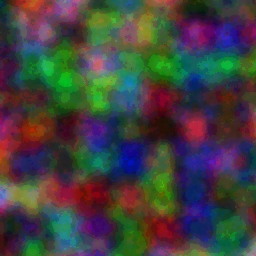
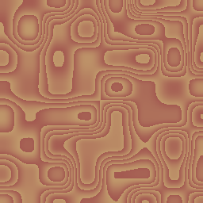
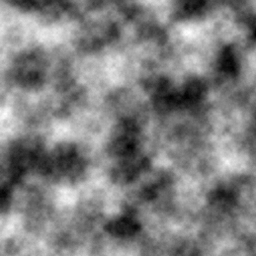
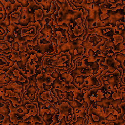
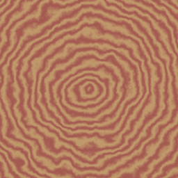
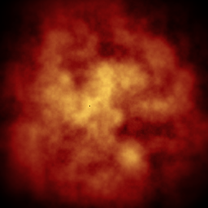
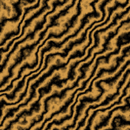
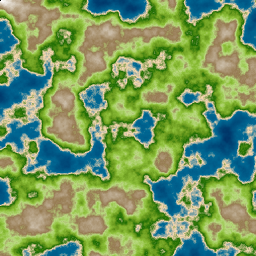

<a href="https://github.com/Amith225/nPerlinNoise/blob/master/LICENSE"></a>
<a href="https://github.com/Amith225/nPerlinNoise"></a>
<a href="https://pypi.org/project/nPerlinNoise"></a>
<a href="https://github.com/Amith225/nPerlinNoise/releases/latest"></a>
<a href="https://github.com/Amith225/nPerlinNoise/releases"></a>
<a href="https://www.python.org/downloads/"></a>
<a href="#"></a>

[](https://forthebadge.com)
[](https://forthebadge.com)
[](https://forthebadge.com)
[](https://forthebadge.com)
[](https://forthebadge.com)

# nPerlinNoise
#### indexed on PyPI - [nPerlinNoise](https://pypi.org/project/nPerlinNoise)
#### repo on GitHub - [nPerlinNoise](https://github.com/Amith225/nPerlinNoise)
#### docs on ReadTheDocs - [nPerlinNoise]("https://readthedocs.org/")

### A robust open source implementation of Perlin Noise Algorithm for N-Dimensions in Python.

- A _powerful_ and _fast_ API for _n-dimensional_ noise.
- Easy hyper-parameters selection of _octaves_, _lacunarity_ and _persistence_
  as well as complex and customizable hyper-parameters for n-dimension
  _frequency_, _waveLength_, _warp_(interpolation) and _range_.
- Includes various helpful tools for noise generation and for procedural generation tasks
  such as customizable _Gradient_, _Color Gradients_, _Warp_ classes.
- Implements custom _PRNG_ generator for n-dimension and can be easily tuned.

**Details**:

- **Technology stack**:
  > **Status**: **`v0.1.3-alpha`** Improving docs and API<br>
  > **All Packages**: [releases](https://github.com/Amith225/nPerlinNoise/releases)<br>
  > [CHANGELOG](docs/CHANGELOG.md)<br>
  > ###### _Tested on Python 3.10, Windows 10_
- **Future work**:
  > **optimization** for higher dimensions and single value coordinates<br>

---

**Screenshots**:

<div align="center">











</div>

---

## Dependencies

- `Python>=3.10.0`

for production dependencies see [Requirements](requirements/requirements.txt)<br>
for development dependencies see [Dev-Requirements](requirements/dev_requirements.txt)

## Installation

```shell
$ pip install nPerlinNoise
```

for detailed instruction on installation see [INSTALLATION](docs/INSTALL.md).

<a id="usage"></a>

## Usage

**Setup**

```pycon
>>> import nPerlinNoise as nPN
>>> noise = nPN.Noise(seed=69420)
```

**Basic usage**

Get noise values at given n-dimensional coordinates by calling ```noise()```,<br>
coordinates can be single value, or an iterable

- ###### single value

  > noise(..., l, m, n, ...)<br>
  > where l, m, n, ..., are single values

    ```pycon
    >>> noise(73)
    array(0.5207113, dtype=float32)
    >>> noise(73, 11, 7)
    array(0.5700986, dtype=float32)
    >>> noise(0, 73, 7, 11, 0, 3)
    array(0.5222712, dtype=float32)
    ```

- ###### iterable

  > noise(...., [l1, l2, ..., lx], [m1, m2, ..., mx], [n1, n2, ..., nx], ....)<br>
  > where ...., are iterable of homogeneous-dimensions
  > the output will be of same shape of input homogeneous-dimensions

  ```pycon
  >>> noise([73, 49])
  array([0.52071124, 0.6402224], dtype=float32)
  >>> noise([73, 49], [2, 2])
  array([0.4563121, 0.63378346], dtype=float32)
  >>> noise([[73], [49], [0]],
  ...       [[2], [2], [2]],
  ...       [[0], [1], [2]])
  array([[0.4563121],
         [0.6571784],
         [0.16369209]], dtype=float32)
  >>> noise([[1, 2], [2, 3]],
  ...       [[1, 1], [1, 1]],
  ...       [[2, 2], [2, 2]])
  array([[0.08666219, 0.09778494],
         [0.09778494, 0.14886124]], dtype=float32)
  ```

`noise(..., l, m, n, ...)` has same values with trailing dimensions having zero as coordinate

- ###### n-dimensionality

  > noise(..., l, m, n) = noise(..., l, m, n, 0) = noise(..., l, m, n, 0, 0) = noise(..., l, m, n, 0, 0, ...)

  ```pycon
  >>> noise(73)
  array(0.5207113, dtype=float32)
  >>> noise(73, 0)
  array(0.5207113, dtype=float32)
  >>> noise(73, 0, 0)
  array(0.5207113, dtype=float32)
  >>> noise(73, 0, 0, 0, 0)
  array(0.5207113, dtype=float32)
  ```

for detailed usage see [EXAMPLE](scripts/main.py)

## API

## How to test the software

- To test Logical consistency run [testLogic](tests/testLogic.py)
- To test Profile Benchmarking run [testProfile](tests/testProfile.py)
- To test Visuals run [testVisuals](tests/testVisuals.py)
- To test Colors run [testCol](tests/testCol.py)

to see all tests see [Tests](tests)

## Known issues

- **_`No Known Bugs`_**
- **_`NPerlin.findBounds is bottleneck`_**
- **_`noise(a, b, c, d, e, f, ...) is slow for single value coordinates`_**

## Getting help

- Check [main.py](scripts/main.py) for detailed usage
- Check [docs](docs) for all documentations
- Check [Usage](#usage) Section

If you have questions, concerns, bug reports, etc.
please file an [issue](https://github.com/Amith225/nPerlinNoise/issues) in this repository's Issue Tracker or
open a [discussion](https://github.com/Amith225/nPerlinNoise/discussions/7) in this repository's Discussion section.

## Getting involved

- `Looking for Contributors for WebApps`
- `Looking for Contributors for Documentation`
- `Looking for Contributors for feature additions`
- `Looking for Contributors for optimization`
- [Fork](https://github.com/Amith225/nPerlinNoise/fork) the repository
  and issue a [PR](https://github.com/Amith225/nPerlinNoise/pulls) to contribute

General instructions on _how_ to contribute [CONTRIBUTING](docs/CONTRIBUTING.md)
and [CODE OF CONDUCT](CODE_OF_CONDUCT.md)

----

## Open source licensing info

1. [TERMS](docs/TERMS.md)
2. [LICENSE](LICENSE)
3. [CFPB Source Code Policy](https://github.com/cfpb/source-code-policy/)

----

## Credits and references

1. Inspired from [The Coding Train](https://www.youtube.com/channel/UCvjgXvBlbQiydffZU7m1_aw)
   -> [perlin noise](https://thecodingtrain.com/challenges/24-perlin-noise-flow-field)
2. hash function by [xxhash](https://github.com/Cyan4973/xxHash)
   inspired the [rand3](src/nPerlinNoise/tools.py) algo
   and ultimately helped for O(1) time complexity n-dimensional random generator [NPrng](src/nPerlinNoise/tools.py)
3. [StackOverflow](https://stackoverflow.com/) for helping on various occasions throughout the development
4. [vnoise](https://github.com/plottertools/vnoise) and [opensimplex](https://github.com/lmas/opensimplex)
   for ideas for README.md
5. docs derivative from [open-source-project-template](https://github.com/cfpb/open-source-project-template)
6. packaging help from [realpython](https://realpython.com/pypi-publish-python-package/)

**Maintainer**:

|        <a href="https://github.com/Amith225"></a>        |
|:-----------------------------------------------------------------------------------------------------------------------------------:|
|                                    **[Amith M](https://www.linkedin.com/in/amith-m-17088b246/)**                                    |
| [](https://instagram.com/amithm3 ) |
